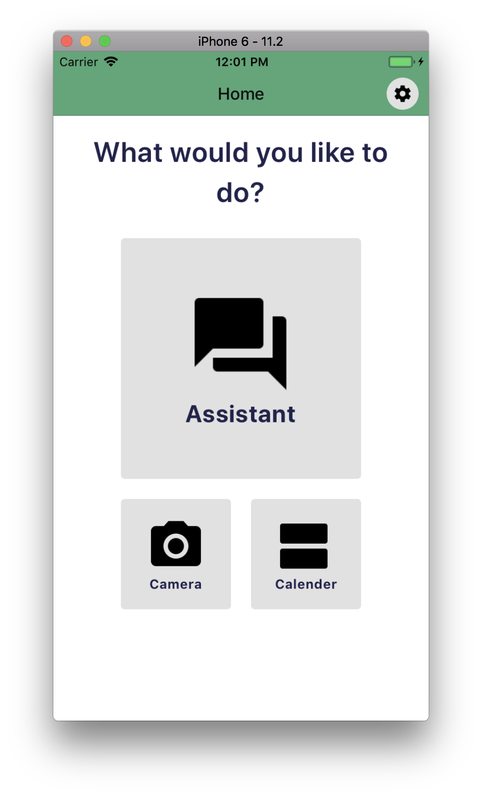
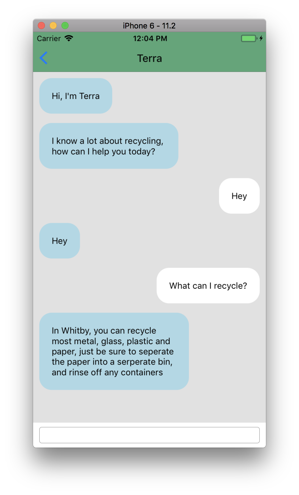
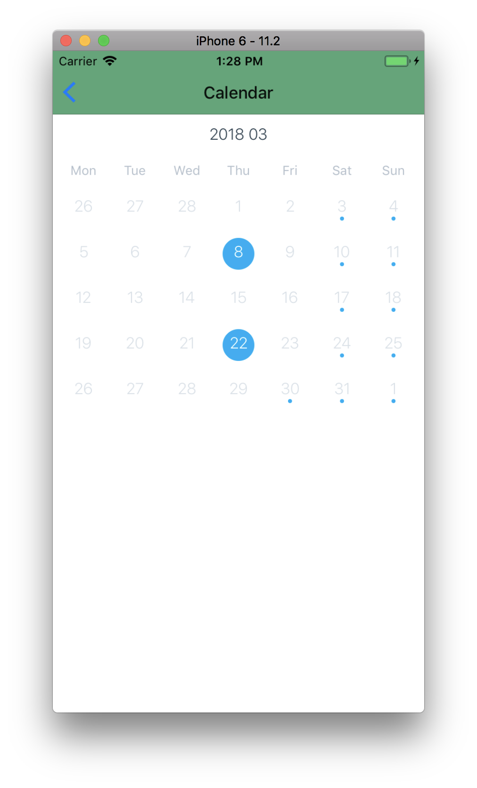

Terra
=====================

A Recycling assistant classification app that uses the Clarifai deep learning api service to categorize items into recycling categories

### How it works




You can take a picture of an item or talk to the assistant, Terra, for help on your recycling inquiries.


## Extra features


There is a calender that will keep track of off peak energy days (in Ontario) along with your recycling days. The header will change color, based on off-peak electricity usage, depending on the current time. (Green for off-peak, Orange for peak operating hours)


### Setup

make sure you have react-native-cli and xcode installed.

Clone this Repo

Run npm install

Run react-native run-ios

In order to use the Clarifai API, you must supply your own API key. One can be obtained by creating a Clearifai Developer account.

create a .env file with the following:

```
CLARIFAI_API_KEY = 'Your key'

```


### Dependencies

* React
* React-Native
* React-native-config
* react-native-camera
* clarifai
* redux
* react-redux
* react-navigation

